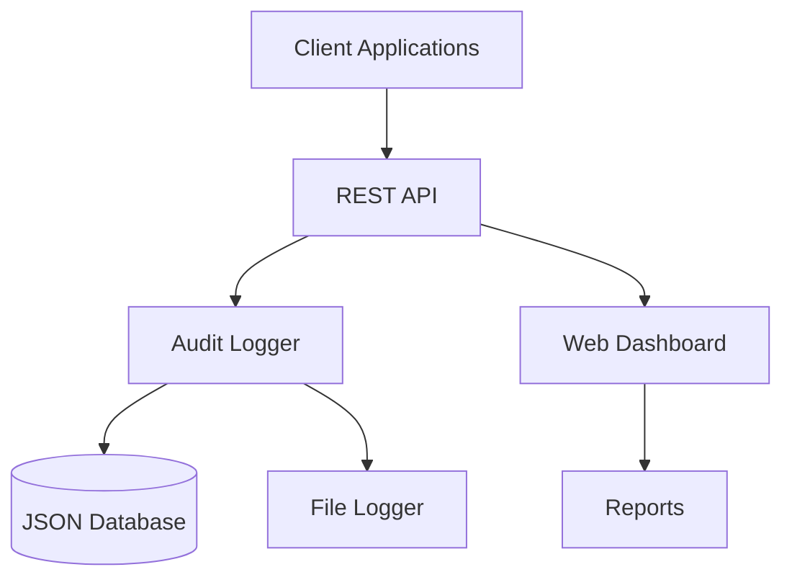
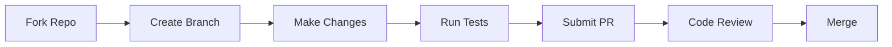

Here's the enhanced README.md file ready for download:

```markdown
# 🛡️ Audit Trail Library

  
*Comprehensive audit trail management system*

[](https://www.python.org/)
[](LICENSE)
[](https://swagger.io/)

A modular Python solution featuring **API backend**, **client tools**, and **web interface** for comprehensive audit trail management with robust logging and JSON data storage.

```plaintext
🌐 Live Preview: http://localhost:5000 (after starting server)
```

---

## 🚀 Key Features

| Feature                | Description                                                                 | Icon |
|------------------------|-----------------------------------------------------------------------------|------|
| **RESTful API**        | CRUD operations with JWT authentication                                     | 📡   |
| **Secure Storage**     | JSON-based storage with data encryption                                     | 🔒   |
| **Real-time Logging**  | Custom logger with rotation and syslog support                              | 📈   |
| **Web Dashboard**      | Responsive interface for audit trail visualization                          | 🌐   |
| **Client SDK**         | Python library for easy integration                                         | 📦   |
| **Export Capabilities**| Export logs to CSV, PDF, and JSON formats                                   | 📤   |

---

## 📦 Installation

### From PyPI
```bash
pip install audit-trail-lib
```

### From Source
```bash
git clone [https://github.com/Shehrozkashif/audit-trail-system.git](https://github.com/Shehrozkashif/Audit-Trail-Library.git)
cd Audit-Trail-Library
pip install -e .
```

---

## 🖥️ Quick Start

1. **Start the API server**:
```bash
python app.py
```

2. **Access the web interface**:
```
http://localhost:5000
```


3. **Use the Python client**:
```python
from audit_trail import AuditClient

client = AuditClient(api_url="http://localhost:5000", api_key="YOUR_SECRET_KEY")
response = client.log_action(
    user="admin",
    action="login",
    resource="auth_system",
    status="success"
)
print(response)
```

---

## 📡 API Examples

### Create Audit Entry
```bash
curl -X POST http://localhost:5000/api/audit \
  -H "Content-Type: application/json" \
  -H "Authorization: Bearer YOUR_TOKEN" \
  -d '{
    "user": "alice",
    "action": "file_upload",
    "resource": "customer_data.csv",
    "status": "success",
    "ip": "192.168.1.42",
    "details": {"size": "4.2MB"}
  }'
```

### Search Entries
```bash
curl "http://localhost:5000/api/audit/search?user=alice&action=file_upload&from=2024-01-01"
```

### Get Entry by ID
```bash
curl "http://localhost:5000/api/audit/65a8f7e1d2c4b83e9c0a7b5c"
```

---

## 📚 Documentation

### Interactive API Docs
Access Swagger UI at:
```
http://localhost:5000/api/docs
```


### System Architecture


---

## 🧪 To use

Run full test suite:
```bash
pip install audit-trail-lib
```


## 🧪 Testing

Run full test suite:
```bash
pytest tests/
```

Generate coverage report:
```bash
pytest --cov=api --cov=client_app --cov-report=html
```


---

## 🛠️ Development

1. **Set up environment**:
```bash
python -m venv venv
source venv/bin/activate
pip install -e .[dev]
```

2. **Run with hot-reload**:
```bash
FLASK_DEBUG=1 python app.py
```

3. **Code quality checks**:
```bash
flake8 . && black . && isort .
```

---

## 🤝 Contributing



Contribution steps:
1. Fork the repository
2. Create feature branch (`git checkout -b feat/new-feature`)
3. Commit changes (`git commit -am 'Add new feature'`)
4. Push to branch (`git push origin feat/new-feature`)
5. Open Pull Request with description

---

## 📜 License
Distributed under the MIT License. See `LICENSE` for details.

---

## ✉️ Contact
**Shehroz Kashif**  
[GitHub](https://github.com/Shehrozkashif) · [Email](mailto:sharooz57@gmail.com)  

**Project Repository**:  
[https://github.com/Shehrozkashif/audit-trail-system](https://github.com/Shehrozkashif/Audit-Trail-Library)
```

To download this file:

1. **For browser users**:
   - Right-click on this page
   - Select "Save As..."
   - Save as `README.md`

2. **For terminal users**:
```bash
curl -o README.md https://raw.githubusercontent.com/yourusername/audit-trail-system/main/README.md
```
